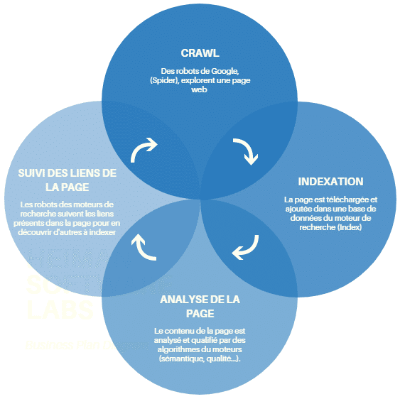

# SEO (Search Engine Optimisation || optimisation pour moteur de recherche) TECHNIQUE

Optimisation du référencement naturel.

#### Référencement naturel: 
* Techniques utilisées par les moteurs de recherche qui classent les résultats qu'ils renvoient aux internautes lorsque ces denriers tapent une requête. 
* Le moteur de recherche de référence est Google (9x% du marché).
* L'orthographe d'une reqête est TRES IMPORTANTE. Les requêtes "restaurants chinios" et "restaurant chinois" n'apportent pas le même nombre de visiteurs.
* Les moteurs de recherchent proposent plusieurs types d'affichages (snippets). Le SEO essaie de se placer aussi sur ces crénaux (micro-données).
* Le référencement naturel est sur le long terme mais apportent à terme des visites "gratuites" sur le site tant qu'on garde un bon positionnement.
* La structure technique d'un site doit être pensé pour le SEO. Il améliore en même temps l'expérience utilisateur.

### SEO Chronophage
Lorsque sortir la carte bleue suffit pour les Adwords , le référencement naturel est un travail d'optimisation qui vise à gagner la confiance de Google. Chaque élément du site doit petre "taillé" pour performer sur les moteurs de recherche.

### SEA (Search Engine Advertising || référencement par la publicité payante)

### Incertitude du référencement naturel 
Le SEO s'appuie sur un intermédiaire **le moteur de recherche**, pour cette raison les actions SEO restent incertènent face à l'évolution et la complexité des algorithmes de Google. ON NE PEUT PAS ETRE SÛR DE LA BONNE ACTION. Une contre action SEO peut intrainer une perte de visibilité.

### Index des moteurs de recherche
C'est une BDD où sont stockés toutes les pages des sites web visités. La mise à jour des sites web dans cette base de données est appelée "indexation".

### Spiders et Crawl
Pour mettre à jour l'index, Google va crawler(explorer) les pages webs avec des "Google Bot" ou "Spider". A chaque page visité, le crawler lit le contenu et le télécharge dans l'index de Google. Permet de voir les modification, nouvelles pages et tente régulièrement d'acceder aux pages innaccessibles. Pour découvrir de nouvelles pages, le crawler suite les liens ```<a>```.


### Requête internaute
L'internaute entre une requête, Google l'enregistre et l'analyse puis renvoie les pages qui lui paraissent le plus pertinent en piochant dans l'index (BDD).

### Serp (Search Engine Results Page || Page de Résultats des Moteurs de Recherche) ou affichage des requêtes
Les réponses proposées sont ensuite affiché dans la SERP de Google (résultats de la recherche). La SERP c'est LA PAGE qui affiche les résultats d'une requête.

### But du moteur de recherche
Fidéliser ses utilisateurs ! Pour cela il détermine en permanence les résultats qui lui semble le plus pertienents par requête.

### Piliers du référencement naturel
* L'optimisation technique
* Les contenus
* La popularité 
Il y a donc deux **niveau** d'optimisation:
* "on-site": optimisation directement sur le site.
* "off-site": optimisation en dehors du site (popularité par exmeple).
 